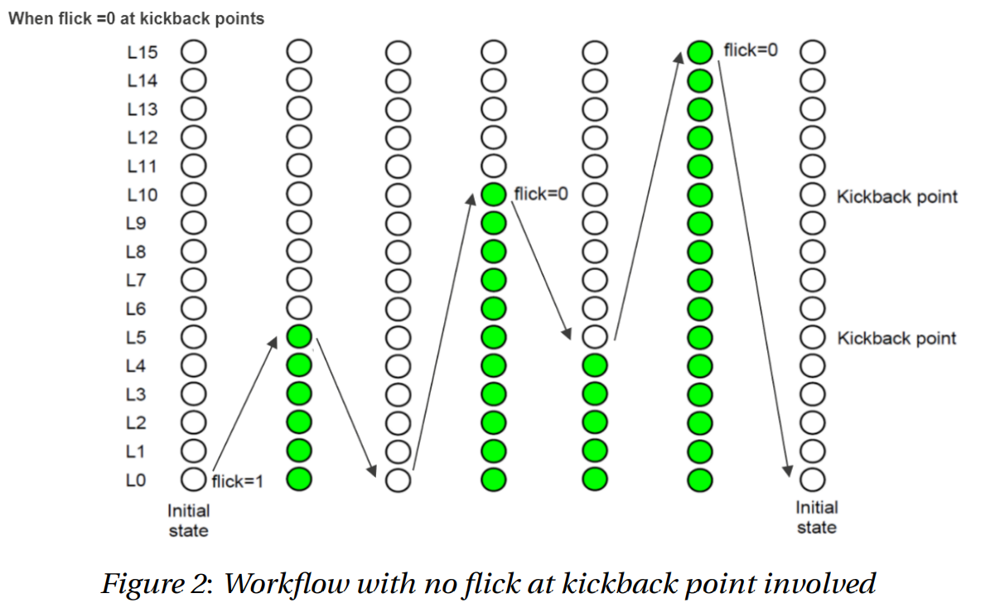
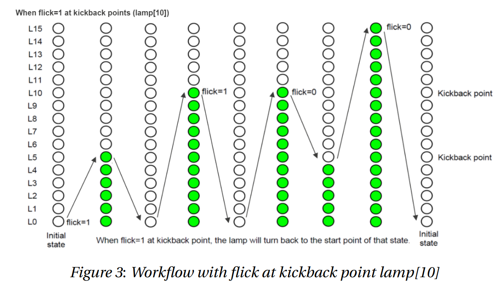
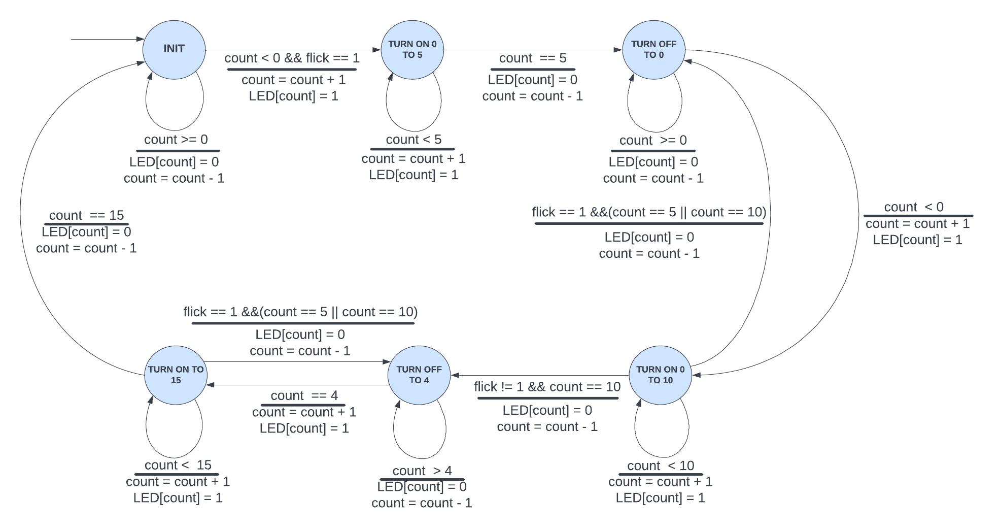
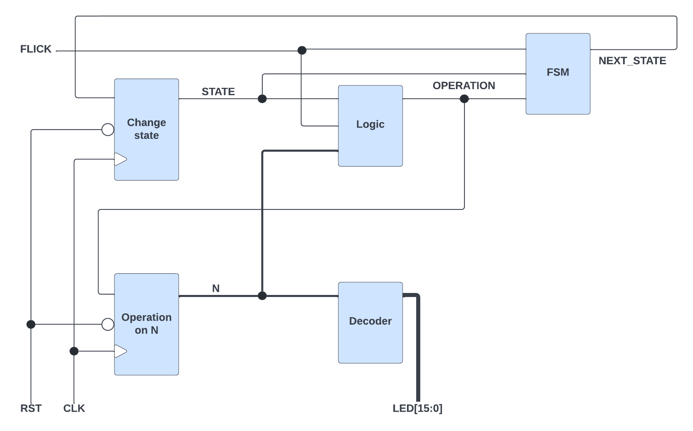

## Project description:
This project is aimed at implementing a module called **Bound Flasher** in verilog, along the process, it also requires to include the module's
finite state machine and its block digram. The wave form and schematic tracer is also available on this post.

## Bound Flasher specification:
  **Expected outcome:** A 16-bit LEDs system that functions accurately as specified below.  
   The system operates based on three input signals and produces one output signal:
* Input - Clock (clk): Clock signal controls the timing of the system and is used as
the main synchronizing event (state transitions happen at positive / rising edge of
clock signal).
* Input - Reset (rst_n): An ACTIVE-LOW asynchronous input signal used to restart
the system to the initial state.
* Input - Flick (flick): An input signal used in controlling state transitions.
* Output - 16-bit LEDs (led): A signal representing the state of 16 lamps of the bound
flasher.
* Typical workflow: At the initial state, all lamps are OFF. If flick signal is ACTIVE (set 1),
the flasher will function according to the following steps:
    - The lamps are turned ON gradually from lamp[0] to lamp[5].
    - The lamps are turned OFF gradually from lamp[5] (max) to lamp[0] (min).
    - The lamps are turned ON gradually from lamp[0] to lamp[10].
    - The lamps are turned OFF gradually from lamp[10] (max) to lamp[5] (min).
    - The lamps are turned ON gradually from lamp[5] to lamp[15].
    - Finally, the lamps are turned OFF gradually from lamp[15] to lamp[0], return to initial state.
    
* **Additional condition:** At each kickback point (lamp[5] and lamp[10]), if flick signal is ACTIVE, the lamps will turn OFF gradually again to the min lamp of the previous state, then continue operation as above description. For simplicity, kickback point is considered only when the lamps are turned ON gradually, except the first state.   

For illustrating purpose, images of typical workflow are attached below:

  
  

## Finite state machine:

  

## Block diagram:

  
